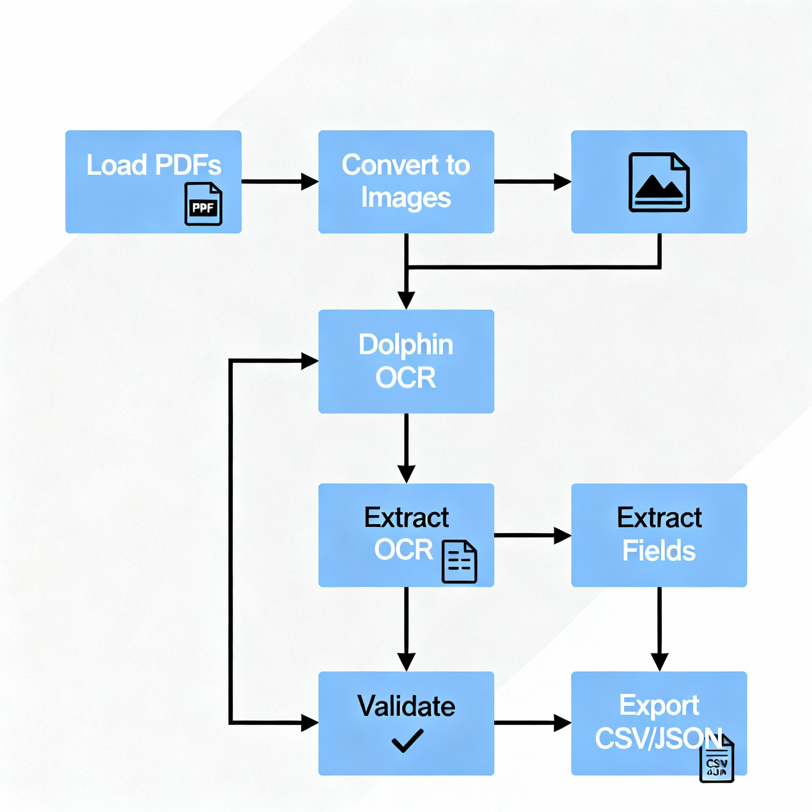

# KnowledgeVerse Invoice OCR with Dolphin

## Problem Statement
Convert scanned invoices (PDFs/images) into structured CSV and JSON datasets using ByteDance's Dolphin OCR model, which excels at handling complex layouts and noisy scans.

## Approach
- Auto-detect GPU/CPU to load Dolphin OCR model
- Extract raw text from PDFs using pdfplumber fallback on PyPDF2
- Use Dolphin OCR on PDFs by converting them to images (300 DPI grayscale)
- Extract invoice fields using regex patterns configurable in `config.py`
- Save parsed invoice headers and line items (currently placeholders) as CSV
- Save raw Dolphin OCR output JSON for auditing

## Flow Diagram
Load Scans → PDF Text Extract / Convert to Images → Dolphin OCR → Regex Extraction → Validation → Export CSV/JSON

## Flow Diagram

## How to Run
pip install -r requirements.txt
python scan2csv.py --in_dir sample_scans --method both

## Sample Output
- `sample_output/invoices_header.csv` contains key invoice fields
- `sample_output/invoices_lines.csv` contains invoice line items (placeholders)
- `sample_output/raw/*.json` contains raw Dolphin OCR output for each scan

## Configuration
- Configure file paths, model names, regex patterns in `config.py`

